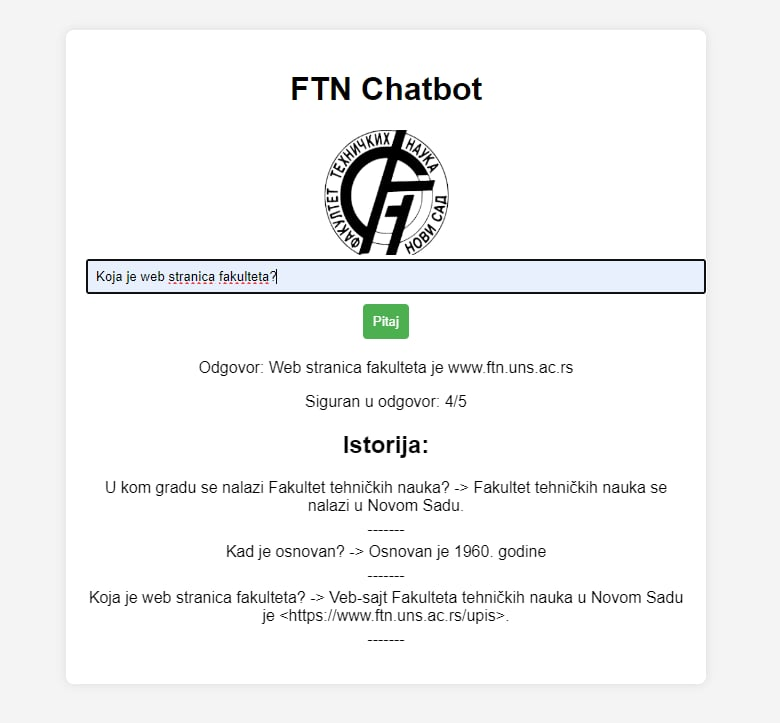

# FTN chatbot

## Overview
FTN Chatbot is RAG (Retrieval-Augmented Generation) chatbot student project developed as part of a master's degree program "Artificial Intelligence and machine learning" of Faculty of Technical Sciences in Novi Sad, Serbia. Utilizing the power of Llama 2 and Langchain, FTN Chatbot provides efficient access to documents related to students, simplifying administrative tasks for both students and faculty staff. 

## Features
- Provides access to a wide range of documents related to students, including but not limited to:
  - Enrollment forms
  - Course schedules
  - Exam regulations
  - Academic calendars
- Offers assistance in navigating through complex administrative processes
- Supports natural language queries for seamless interaction
- Integrates with existing systems to fetch and update document data in real-time
- Self-check mechanism to ensure response faithfulness within a specified range
- GUI implemented with Flask, HTML, and CSS for user-friendly interaction
- Additional unit tests for comprehensive testing and quality assurance

## Technology Stack
- Programming Language: Python
- Utilizes Llama 2 and Langchain for enhanced functionality
- Natural Language Processing (NLP) tools for understanding user queries
- Integration with existing databases and document management systems
- Flask, HTML, and CSS for GUI development
- Unit tests for quality assurance

## Usage
To use the FTN Chatbot, simply initiate a conversation and ask for assistance with your query. The chatbot will analyze your request and provide relevant information or guidance accordingly. Additionally, the self-check mechanism ensures that responses are faithful within a specified range. If the response falls below the threshold, the chatbot will return a default answer.

## Contributors
- Igor Mandarić
- Stefan Dragičević
- Ivana Leščuk

## License
This project is licensed under the MIT License.
